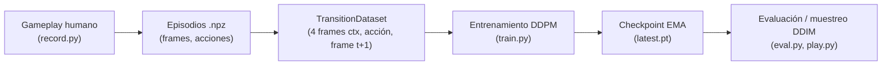

# World Model de CoinRun — Difusión condicional de siguiente frame

Proyecto final del curso de Modelos Generativos (UTEC). Un modelo de difusión
aprende la dinámica del juego [CoinRun (procgen)](https://github.com/openai/procgen)
a partir de gameplay humano: dado los últimos 4 frames y la acción del jugador,
genera el siguiente frame. Entrenado, el modelo funciona como un simulador
neuronal del juego — se puede "jugar" dentro de él sin el motor original.

**Autores:** Gabriel Espinoza y Diego GCH.

## Arquitectura

DDPM condicional estilo [DIAMOND](https://arxiv.org/abs/2405.12399), a escala reducida:

- **UNet de 11.9M parámetros**: canales 64/128/256 en resoluciones 64/32/16,
  2 bloques residuales por nivel, self-attention en el nivel 16×16 y el bottleneck.
- **Entrada** (15 canales): el frame objetivo con ruido (3) concatenado con los
  4 frames de contexto (12).
- **Condicionamiento**: embedding sinusoidal del timestep + embedding aprendido
  de la acción (15 acciones), sumados e inyectados en cada bloque residual vía
  FiLM (scale-shift).
- **Objetivo**: v-prediction con schedule coseno de 1000 timesteps.
- **Muestreo**: DDIM de 20 pasos (η=0).

Código del modelo en [`world_model/wm.py`](world_model/wm.py).

## Datos y preprocesamiento

- **Dataset**: 1,904 episodios (~165k transiciones) de CoinRun jugado por humanos,
  grabados con [`record.py`](record.py) a 64×64×3 (la observación real del agente).
  Cada paso guarda (frame, acción, reward). No se incluye en el repo por tamaño (144MB).
- **Split**: por sesión de grabación (19 sesiones de train / 2 de validación),
  para que ningún nivel se filtre entre splits.
- **Preprocesamiento**: mínimo — normalización de píxeles a [-1, 1]
  (`x/127.5 - 1`), apilado de los 4 frames de contexto como canales, y
  edge-padding (repetir el primer frame) al inicio de cada episodio.
  Sin augmentation ni resize (los frames ya son 64×64).

## Flujo de entrenamiento

El proceso completo, de juego humano a simulador neuronal:



1. **Grabación** — `record.py` envuelve el entorno gym3 de procgen: mientras un
   humano juega, guarda cada transición (frame 64×64 visto *antes* de la acción,
   acción presionada, reward) en archivos `episode_*.npz` por sesión.
2. **Carga** — al iniciar el entrenamiento, los ~165k frames se cargan completos
   a RAM (≈2 GB en uint8) y se indexan como transiciones: contexto = frames
   `t-3..t` (con edge-padding al inicio del episodio), objetivo = frame `t+1`.
3. **Paso de entrenamiento** (se repite 25k veces):
   - se muestrea un batch de transiciones y un timestep aleatorio `t ~ U[0, 1000)`;
   - se corrompe el frame objetivo con ruido gaussiano según el schedule coseno:
     `x_t = √ᾱ_t·x_0 + √(1-ᾱ_t)·ε`;
   - el UNet recibe `x_t` + los 4 frames de contexto + embeddings de timestep y
     acción, y predice `v = √ᾱ_t·ε − √(1-ᾱ_t)·x_0`;
   - loss = MSE entre la `v` predicha y la real; backprop con AdamW;
   - se actualiza una copia EMA de los pesos (decay 0.999), que es la que se
     usa para evaluar y muestrear (más estable que los pesos crudos).
4. **Checkpoints** — cada 2000 pasos se guarda `latest.pt` (modelo + EMA +
   optimizador + paso) con escritura atómica; `--resume` continúa donde quedó,
   y el loss se registra en `loss.csv` (curva con `plot_loss.py`).
5. **Inferencia** — para generar un frame se parte de ruido puro y se aplican
   20 pasos de DDIM: en cada paso el UNet predice `v`, de ahí se reconstruyen
   `x_0` y `ε`, y se da un paso determinista hacia menos ruido. Encadenando
   frame a frame (autoregresivo) el modelo "sueña" gameplay completo.

## Entrenamiento

| | |
|---|---|
| Pasos | 25,000 (batch 128 ≈ **22 épocas**) |
| Optimizador | AdamW, lr 1e-4 |
| Pesos | EMA con decay 0.999 (se evalúa con los pesos EMA) |
| Hardware | Kaggle GPU T4 (~8 h); también corre en Apple Silicon (MPS) |
| Loss | MSE sobre v-prediction: 1.0 → **0.0084** |

## Resultados (validación, predicción a 1 paso)

| Métrica | Modelo | Baseline (copiar último frame) |
|---|---|---|
| PSNR | **31.44** | 29.95 |
| SSIM | **0.8903** | 0.7168 |

El checkpoint entrenado está en la
[release v1.0](https://github.com/Gabrieleeh32159/proyecto-final-modelos-generativos/releases/tag/v1.0)
(descargar `latest.pt` a `world_model/checkpoints/`).

## Uso

```bash
pip install torch numpy imageio tqdm matplotlib

# grabar un dataset propio (requiere procgen compilado, ver PROCGEN.md)
python record.py --difficulty easy

# entrenar
python world_model/train.py                    # 100k pasos; --resume para continuar

# evaluar: métricas + grid de muestras + GIF real-vs-sueño
python world_model/eval.py --rollout 100

# curva de loss
python world_model/plot_loss.py

# jugar dentro del modelo (flechas; el sueño avanza solo)
python world_model/play.py
```

## Estructura

- `world_model/` — modelo, entrenamiento, evaluación y demo interactivo (+ tests: `pytest world_model/test_wm.py`)
- `record.py` — grabador de gameplay humano sobre `procgen.interactive`
- `docs/superpowers/` — spec de diseño y plan de implementación
- El resto del repo es el fork de [openai/procgen](https://github.com/openai/procgen) (motor C++ del juego) — su README original está en [PROCGEN.md](PROCGEN.md).
